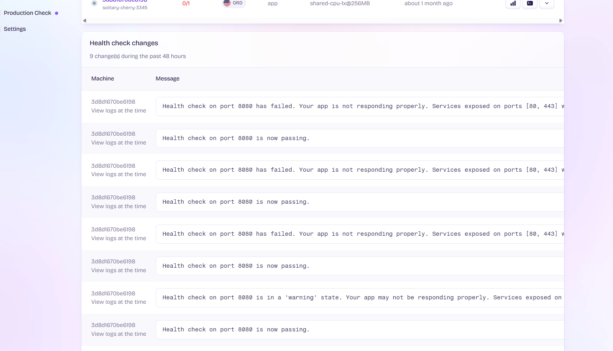

## Resilience
The application implements several resilience patterns to the usage and interaction with the routines service:

- Timeout policies
- Retry with exponential backoff
- Circuit breaker
- Health checks

The Microsoft.Extensions.Http.Resilience package was implemeted with a toml configurations to achieve the desire behavior.

### Timeout
2 main timeout where added:
- General Timeout: The general timeout involve the entire request.
- Each request Timeout: Given that a retry policy was implemented, a timeout of each retry try was implemented.

#### Configuration
```cs
//General reques timeout
pipeline.AddTimeout(TimeSpan.FromSeconds(5));

//Timeout per try
pipeline.AddTimeout(TimeSpan.FromSeconds(5));
```

### Retry Policy
The retry policy was configured with the next parameters:
- MaxRetryAttempts: Sets how many times the application will retry a failed request. The default value in configurable with the variable DefaultRetryAttemps that is inside the appsetting.json.
- BackoffType: Uses exponential backoff, meaning each retry waits longer than the previous one.
- UseJitter: Adds random variation to retry intervals to prevent multiple retries happening simultaneously.
- Delay: Sets the initial delay between retries.

#### Configuration
```cs
int defaultRetryAttemps = builder.Configuration.GetValue<int>("DefaultRetryAttemps");

//Retry with Exponential Backoff and Jitter
pipeline.AddRetry(new HttpRetryStrategyOptions
{
    MaxRetryAttempts = defaultRetryAttemps,
    BackoffType = DelayBackoffType.Exponential,
    UseJitter = true,
    Delay = TimeSpan.FromMicroseconds(500)
});
```

### Circuit Breaker

- SamplingDuration: Window of time (10 seconds) during which the circuit breaker monitors failures
- FailureRatio: If 90% (0.9) of requests fail during the sampling duration, the circuit opens
- MinimumThroughput: Requires at least 10 requests within the sampling duration before making decisions
- BreakDuration: When circuit opens, it stays open for 5 seconds before allowing a new attempt

#### Configuration
```cs
//Circuit Breaker
pipeline.AddCircuitBreaker(new HttpCircuitBreakerStrategyOptions
{
    SamplingDuration = TimeSpan.FromSeconds(10),
    FailureRatio = 0.9,
    MinimumThroughput = 10,
    BreakDuration = TimeSpan.FromSeconds(5)
});
```

### Health Checks
The application implements health checks through Fly.io configuration:

#### Configuration
```toml
[[http_service.checks]]
  interval = "15s"      # Check frequency
  timeout = "2s"        # Max time to wait for response
  grace_period = "10s"  # Initial delay before starting checks
  method = "GET"        # HTTP method used
  path = "/api/status/" # Endpoint to check
```

#### Check Behavior
- Runs every 15 seconds
- Fails if response takes longer than 2 seconds
- Allows 10 seconds grace period during startup
- Expects a successful response from `/api/status/` endpoint
- Uses HTTPS protocol (enforced by X-Forwarded-Proto header)

#### Fly.io examples

