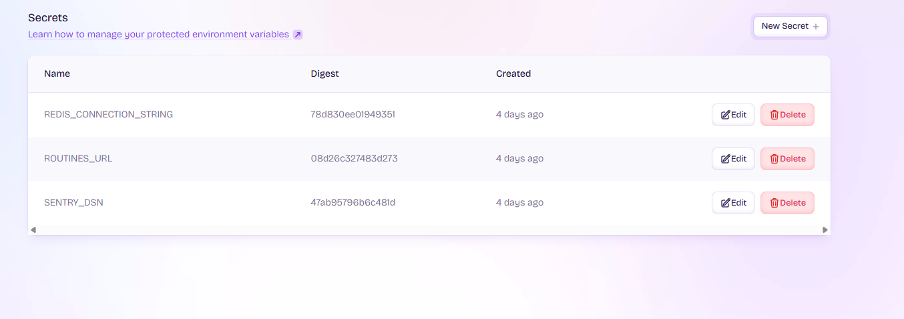

## Security

### Secrets management
Regarding the management of the secrets, I used the fly.io secrets to manage them. On the side of the code, those secrets have to be managed as enviroment variables:

```cs
Environment.GetEnvironmentVariable("ROUTINES_URL");
```

### Secrets in fly.io


And the secrets have to be recorded throught the platform or whith the next terminal command:
<pre>fly secrets set MY_SECRET_KEY=super-secret-value</pre>

### TLS Support
The fly.io platforms support the usage of TLS, which means that all endpoints are encrypted and secured.
More information about the ciphers allowed: [Documentation](https://fly.io/docs/networking/tls/)

#### Configuration
This can be done in the initial toml file, in the "force_https" flag. The flag has to be true to force the usage of TLS.

```toml
[http_service]
  internal_port = 8080
  force_https = true
  auto_stop_machines = 'stop'
  auto_start_machines = true
  min_machines_running = 0
  processes = ['app']
```
