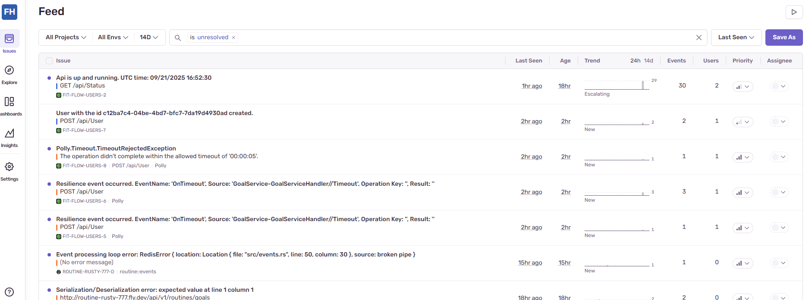

## Security

### Secrets management
Regarding the management of the secrets, I used the fly.io secrets to manage them. On the side of the code, those secrets have to be managed as enviroment variables:

```cs
Environment.GetEnvironmentVariable("ROUTINES_URL");
```

### Secrets in fly.io


And the secrets have to be recorded throught the platform or whith the next terminal command:
<pre>fly secrets set MY_SECRET_KEY=super-secret-value</pre>
